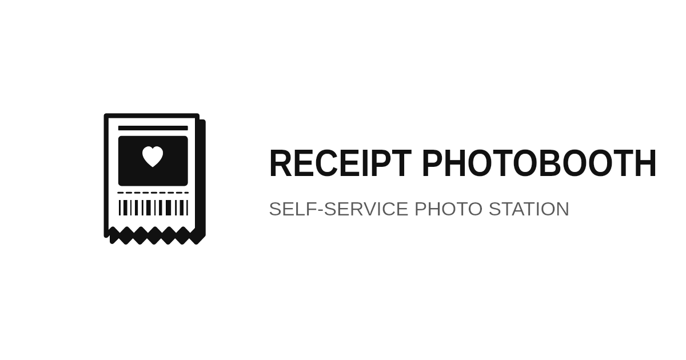
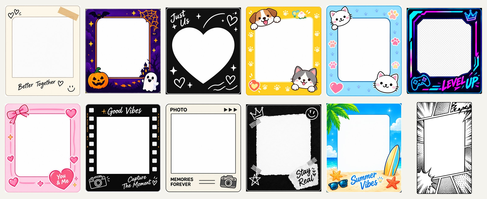
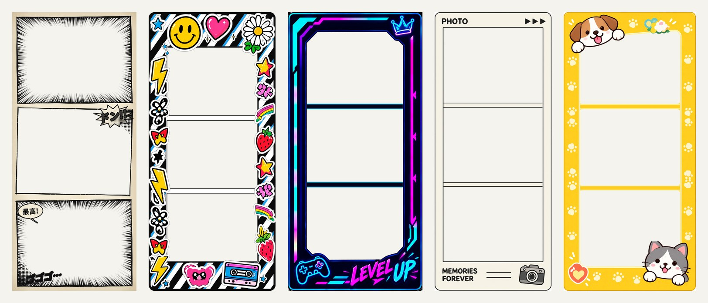
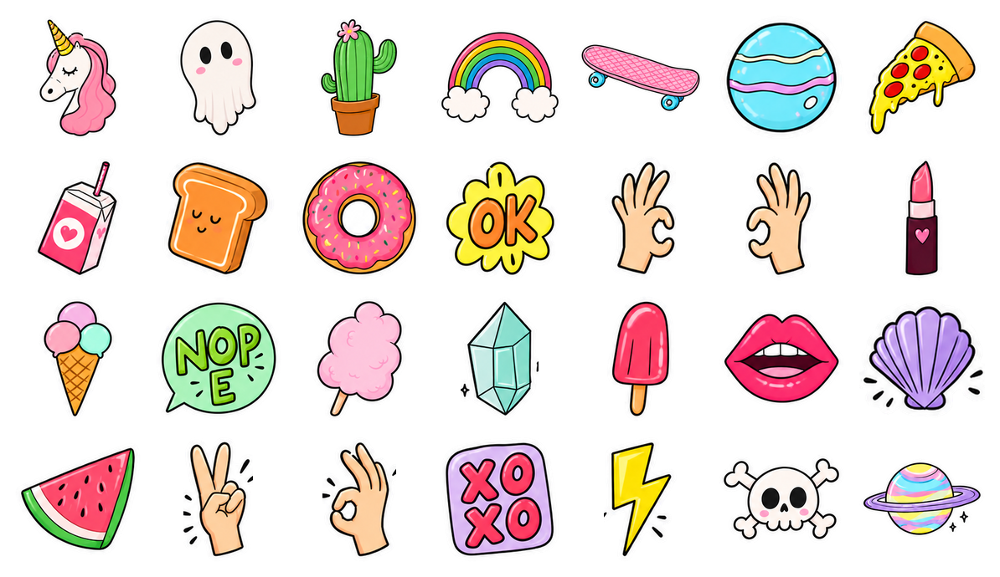

<div align="center">



### A self-service photobooth that prints your photos on a receipt.

Guests tap, smile, decorate, and a thermal printer hands them a keepsake strip.<br>
Optionally they scan a QR code and take the colour photo and a GIF home.

<br>


[✨ Features](#-what-it-does) · [🎞️ Gallery](#-gallery) · [🚀 Quick start](#-quick-start) · [🖨️ Printers](#-printers-it-talks-to) · [🔧 Owner panel](#-the-owner-panel) · [📚 Docs](#-docs)

</div>

---

```
 ┌────────────────────────────────────┐
 │          R E C E I P T             │
 │        P H O T O B O O T H         │
 │ - - - - - - - - - - - - - - - - -  │
 │  DATE ............... today        │
 │  ITEM ............... 1 x memory   │
 │  PRICE .............. one big grin │
 │ - - - - - - - - - - - - - - - - -  │
 │       T A P   T O   S T A R T      │
 │  ║│║║│││║│║║│║│║││║║│║║│││║│║║│   │
 │    KEEP THE RECEIPT. KEEP THE      │
 │            MOMENT.                 │
 └╲╱╲╱╲╱╲╱╲╱╲╱╲╱╲╱╲╱╲╱╲╱╲╱╲╱╲╱╲╱╲╱╲╱╲╱┘
```

Black ink, white paper, hand-drawn doodles, and a very satisfying *brrrrrt*.

## ✨ What it does

| | |
|---|---|
| 📸 **Shoots** | Countdown, flash, 1 to 4 photos, retake any shot |
| 🎨 **Decorates** | Strip layouts, receipt-style frames, filters, drag-and-pinch stickers (no text tools, so no surprises) |
| 🖨️ **Prints** | Photos become crisp 1-bit art through a tunable dithering pipeline, sent as ESC/POS to 58 mm or 80 mm paper |
| 📱 **Shares** | One QR code opens a phone page with the colour photo and animated GIF |
| 🌗 **Looks good anywhere** | Light, Dark or System theme. The receipt stays paper-white in every mode |
| 🛡️ **Survives guests** | Crash recovery, inactivity reset, screen wake lock, offline-capable PWA |

## 🔄 The guest flow

```
 🏁 Standby  →  🧩 Layout  →  📸 Camera  →  🎨 Edit  →  👀 Preview  →  🖨️ Print  →  📱 Share  →  🎉 Success
```

## 🎞️ Gallery

### 🖼️ Frames

Every frame is data-driven and comes in six layouts (single, classic, 2x2 grid, and 2, 3 or 4 photo strips).



### 🧾 Strips

The same frames as 3-photo strips, the way they come out of the booth.



### 🎀 Stickers

28 hand-drawn stickers. Guests can add as many as they like, then move, resize, rotate or delete each one.



## 🖨️ Printers it talks to

| 🪟 System dialog | 🗂️ Windows queue | 🔌 USB (direct) | 🌐 Network (LAN/Wi-Fi) | 📶 Bluetooth (BLE) | 🧪 Test printer |
|:---:|:---:|:---:|:---:|:---:|:---:|
| Browser print | Via the bridge | WebUSB | Via the bridge | Web Bluetooth | Prints nothing |

> 💡 Windows and network printing go through a tiny local **print bridge** (`npm run bridge`).
> The **Test printer** is for developing without hardware.

## 🚀 Quick start

```bash
npm install
npm run dev          # the booth, at http://localhost:5173
```

Open the booth on a device with a camera. With the default **Test printer**, nothing prints, so you can click through the whole flow safely.

| Command | What it does |
|---|---|
| 🎪 `npm run dev` | Start the booth |
| 🌉 `npm run bridge` | Print bridge, only for Windows/network printers and local photo sharing |
| 📦 `npm run build` | Typecheck + production build |
| ✅ `npm test` | The test suite |
| 🔍 `npm run typecheck` | Types only |

## 🔧 The owner panel

Tap the little **heart** ❤️ on the standby screen (or visit `/admin`) and enter the owner PIN. The first visit asks you to create one.

Settings are grouped by topic:

| | Section | What's inside |
|---|---|---|
| 🖨️ | **Printer** | Type, connection details, check, test print |
| 🎚️ | **Print quality** | Preset, dither, brightness, contrast, density, paper, cut, with a pinned test-print preview |
| 📱 | **Photo sharing** | The QR code and where photos live |
| 🌗 | **Appearance** | Light / Dark / System |
| 🔐 | **Security** | Change the PIN |

There is a search box at the top 🔎, and every change saves instantly.

## ☁️ Photo sharing

Two ways to host the files behind the QR code:

1. **🟢 Supabase Storage**: copy `.env.example` to `.env.local` and fill in `VITE_SUPABASE_URL` and `VITE_SUPABASE_PUBLISHABLE_KEY`. Only the publishable key ever goes in the browser. Setup is in [`docs/SUPABASE.md`](docs/SUPABASE.md).
2. **🌉 The print bridge**: it stores files and serves them on a separate read-only port. See [`docs/SHARE.md`](docs/SHARE.md).

## 🌙 Theming

All colours live in one file, `src/styles/tokens.css`, as semantic tokens (`--bg`, `--surface`, `--ink`, `--edge` and friends). The dark theme is slate rather than black, and a test keeps both palettes at WCAG AA contrast. Anything that represents the physical print (receipt, stickers, print preview) is deliberately **not** themed.

## 🗺️ Where things live

```
src/
  screens/         every step a guest sees (standby → layout → camera → edit → preview → print → share → success)
  screens/admin/   the owner panel, one file per settings section
  print/           bitmap pipeline, ESC/POS encoder, printer adapters
  render/          one renderer shared by editor, preview and printer
  frames/ layouts/ filters/ stickers/    data-driven, add an entry to add one
  share/           QR + upload + the phone result page
  theme/           Light / Dark / System
  styles/          tokens.css, global.css, admin.css
bridge/            the local print + share bridge (Node)
docs/              architecture, printing, deployment, owner guide
```

> ➕ Adding a setting? Put it in a card in `src/screens/admin/`, and navigation, mobile menu and search pick it up automatically.

## 📚 Docs

| | | |
|---|---|---|
| 🏛️ [Architecture](docs/ARCHITECTURE.md) | 🖨️ [Printing](docs/PRINTING.md) | 🌉 [Bridge](docs/BRIDGE.md) |
| 📱 [Share](docs/SHARE.md) | 🟢 [Supabase](docs/SUPABASE.md) | 🚢 [Deployment](docs/DEPLOYMENT.md) |
| 📖 [Owner guide](docs/OWNER-GUIDE.md) | ✅ [Release checklist](docs/RELEASE-CHECKLIST.md) | 🤝 [Handoff](docs/HANDOFF.md) |

## 🧰 Built with

React 19 · TypeScript · Vite · vite-plugin-pwa · Vitest · Courier Prime (bundled, OFL)

---

<div align="center">

<sub>🎉 Made for parties, weddings, pop-ups, and anyone who thinks a photo should come with a tear-off edge. 🧾</sub>

</div>
